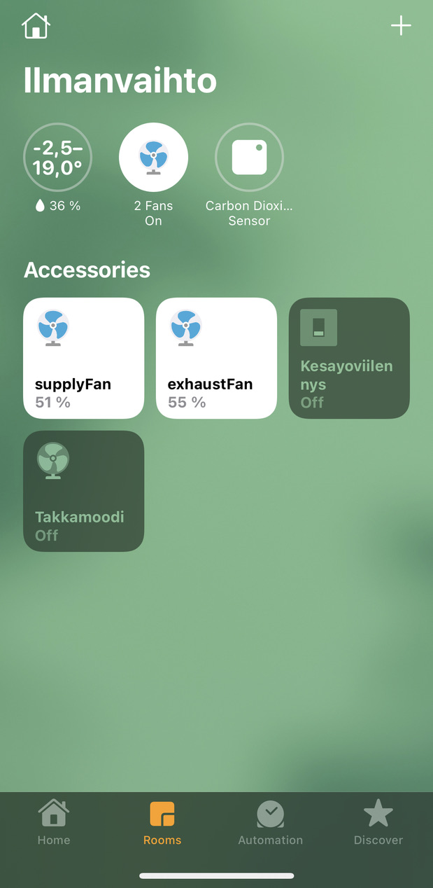

Some scripts to read data from air pumps using Ouman.io API (at least Swegon)

Ouman.io provides a websocket API but there's no documentation for it (or at least I couldn't find any). Luckily Javascripts are practically never obfuscated. The data _could_ be read by subscribing to listen for changes, but I couldn't figure out how to get actual timestamps for the data so I decided to use the `trends` endpoint to read a bunch of values periodically. Using a REST API would be much easier, but I guess websockets are the current hype for everything.

Feel free to use and modify these as you will. Please let me know of any improvements you make for yourself.

Functionality
=============
- collect data for long periods
- store data in SQLite database
- read individual values
- write individual commands
- directly usable with [homebridge](https://homebridge.io)

Prerequisites
=============
- get a computer (e.g. a virtual server or a Raspberry Pi)
- install Nix (or manually all the things used in scripts)
- install homebridge & plugins
  - `npm install -g --unsafe-perm homebridge`
  - `npm install -g --unsafe-perm homebridge-cmd4`

Setup
=====
Assuming user home directory
```
cd ~
```

Clone this repo
```
git clone https://github.com/jyrimatti/ouman.git
```

Store Ouman.io credentials
```
echo '<my ouman user>' > .ouman-user
echo '<my ouman password>' > .ouman-pass
chmod go-rwx .ouman*
```

Create database
```
./ouman_createdb.sh
```

[Setup cronjobs](#cron)

[Setup Homebridge](#homebridge-configuration)

~~profit!~~

Dependencies
============

Just install Nix, it handles all the dependencies for you.

However, constantly running nix-shell has a lot of overhead, so you might want to install all the required dependencies globally, and bypass nix-shell when executing scripts from within other processes (cron, cgi, homebridge...):

For example, installing with Nix:
```
> nix-env -f https://github.com/NixOS/nixpkgs/archive/nixos-23.05-small.tar.gz -iA nixpkgs.dash nixpkgs.sqlite nixpkgs.websocat nixpkgs.curl nixpkgs.jq nixpkgs.gnused nixpkgs.gnugrep nixpkgs.coreutils nixpkgs.flock nixpkgs.findutils nixpkgs.rsync
```

Then create somewhere a symlink named `nix-shell` pointing to just the regular shell:
```
> mkdir ~/.local/nix-override
> ln -s /home/pi/.nix-profile/bin/dash ~/.local/nix-override/nix-shell
```

after which you can override nix-shell with PATH:
```
PATH=~/.local/nix-override:$PATH ./homebridge/fireplace.sh
```

Cron
====
Use cron job to read values periodically, for example:
```
MAILTO=pi
USER=pi
PATH=/home/pi/.local/nix-override:/home/pi/.nix-profile/bin

4,9,14,19,24,29,34,39,44,49,54,59 * * * * cd ~/ouman; ./ouman_collect2db.sh 2>&1 1>/dev/null
```

This will periodically read specified datasets from Ouman.io and store them to the databases ignoring consecutive duplicate values.

Read and write
==============

Reading a value from Ouman.io (in this case `fireplaceFunction`):
```
./ouman_get.sh fireplaceFunctionActive
```

Writing a value to Ouman.io (in this case `fireplaceFunction`):
```
./ouman_post.sh fireplaceFunctionOn 1
```

You can see all available values/commands (that I know of) in `ouman_objects.sh`

See the ready made scripts in `./cmd`

Homebridge configuration
========================



You can use these scripts with Homebridge to show and modify values with Apple HomeKit.

See [example configuration](./homebridge-config.json).

External hosting
================
If you prefer to serve your graphs from another server, you can configure cronjobs to sync the databases to it. The scripts use vacuum to create an immutable snapshot to sync.

```
MAILTO=pi
USER=pi
PATH=/home/pi/.local/nix-override:/home/pi/.nix-profile/bin

0,15,30,45 * * * * cd ~/ouman; ./ouman_rsync.sh <remoteuser> <remotehost> <remotepath> 2>&1 1>/dev/null
```

Standing on the shoulders of
============================
- [curl](https://curl.se)
- [websocat](https://github.com/vi/websocat)
- [jq](https://stedolan.github.io/jq/)
- [SQLite](https://www.sqlite.org/index.html)
- [homebridge](https://homebridge.io)
- [cmd4](https://github.com/ztalbot2000/homebridge-cmd4)